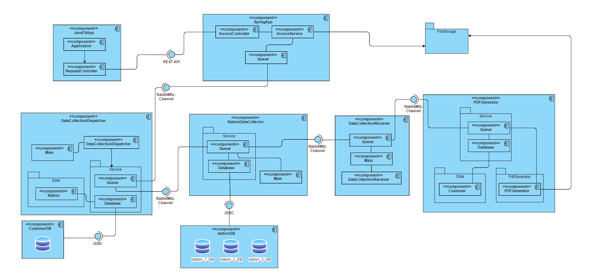

# Fuel Station Project Documentation

## About the project

This project was created by Hadi Heydari, Kevin Xhunga and Safwan Zullash
as a team for our company which manages charging stations for electric cars. The goal of this project is the fullstack development 
of a Fuel Station App. Customers can use this application to generate invoices for their electric car charging activities. 

For the frontend we used a simple JavaFX UI and to build our API we used the SpringBoot framework. 
Furthermore, we used RabbitMQ to align our messages and requests between the services and the databases, which are PostgreSQL instances.
To accommodate the whole development team and ensure the same working environments for everyone we used GitHub 
as our version control system to host our repository (link to repository can be found [here](#clone-the-project-repository)) and additionally make use of Docker containers for the databases and the RabbitMQ instance.

## System Architecture

This UML diagram visualises our system architecture:



## Set-Up and Installation

### Clone the project repository

To use our application first you need to clone this whole project from our [GitHub repository](https://github.com/wi21b030/FuelStation). 
You can either do this with for example IntelliJ's built-in tool or run this command in your preferred command line interpreter within the directory you wish to save the project in:

```bash
cd "path/to/your/desired/folder/"
git clone "https://github.com/wi21b030/FuelStation.git"
```

### Start application modules and services

Then follow these steps:

1. Start your Docker Desktop application and then open your preferred command line interpreter and run the commands below. This will run the docker-compose file and create the databases and the RabbitMQ queue in a containerised environment.
    ```bash
    cd "./Backend/Databases" # switch to this directory starting from the root directory of this project
    docker compose up
    ```
2. Once the containers are up and running you need to open this project in IntelliJ.
3. Then run these parts of the application in this order:
   1. Java FX UI - [Here](./Frontend/JavaFXApp/src/main/java/com/example/javafxapp/HelloApplication.java)
   2. SpringBoot API - [Here](./Backend/SpringApp/src/main/java/com/example/springapp/SpringAppApplication.java)
   3. DataCollectionDispatcher - [Here](./Backend/DataCollectionDispatcher/src/main/java/org/example/Main.java)
   4. StationDataCollector - [Here](./Backend/StationDataCollector/src/main/java/org/example/Main.java)
   5. DataCollectionReceiver - [Here](./Backend/DataCollectionReceiver/src/main/java/org/example/Main.java)
   6. PDFGenerator - [Here](./Backend/PDFGenerator/src/main/java/org/example/PdfGenerator/PDFGenerator.java)

After you have started all these you can now use the application.

## Lessons Learned

Throughout the development of this project, our team gained following key lessons:

1. **Effective collaboration with version control:** 
   Working as a team and making use of a version control tool like GitHub improved our collaboration and code management. 
   It allowed us to work concurrently on different parts of the project, track changes, merge code and resolve conflicts.

2. **Speed and ease of development environments with Docker:** 
   Docker containers played an important role in making our development process faster and easier. 
   By containerizing our databases and RabbitMQ instance, we ensured consistency across different team members' environments.

3. **Learning curve of new technologies:**
   As we incorporated new technologies like JavaFX, Spring Boot, and RabbitMQ into our project, 
   we encountered a learning curve, but documentation and online resources helped us to obtain 
   new skills and make use of them appropriately.
   For the usage of RabbitMQ it was important to have a clear understanding of how the messages are sent and received, and to agree on a pattern.

4. **Clear communication and coordination:** 
   Effective communication and coordination among team members was essential for the success of the project. 
   Regular meetings, clear task assignment, and ongoing updates ensured that everyone was on the same page.

5. **Understanding system architecture and component integration:** 
   Developing a distributed system required a clear understanding of the overall system architecture 
   and how different components interacted with each other. Therefore, it was important that every team member understood the
   design decisions and the theory behind them. 

6. **Error handling and troubleshooting:**
   Throughout the project, we learned the importance of thorough error handling and debugging 
   to identify and resolve issues promptly.

There is still a lot of room to improve especially when it comes to making our components and modules more loosely coupled and reusable
for future scaling and using interfaces more often, which is something we missed out on because of time bottlenecks regarding other projects 
that each member of the team simultaneously had to work on. Furthermore, we were a bit restricted by having specific demands from management
i.e. on which technologies to use such as JavaFX and SpringBoot, because some team members have different skill sets and experiences.
Therefore, we would prefer to find a way in the future to be more flexible in this aspect. Ultimately we learned a lot and have gained experiences
that will be valuable for future projects.

## Unit-Testing Decisions

Here you can see a decision matrix on which components we tested and why we tested them:

| Component                | Reason for Testing                                                                                           |
|--------------------------|--------------------------------------------------------------------------------------------------------------|
| Java FX UI               | Not tested due to limited functionality, dependency on user interaction, and focus on backend functionality. |
| SpringBoot API           | - Tested the `gatherData` method to ensure proper handling of creating a data gathering request              |
|                          | - Tested the `gatherInvoice` method to ensure proper retrieval of invoices                                   |
| DataCollectionDispatcher | - Tested the `getDatabase` method to verify the correct retrieval of station data                            |
| StationDataCollector     | - Tested the `getKWH` method to check the retrieval of kWh data from the queue                               |
| DataCollectionReceiver   | - Tested the `calculateTotal` method to verify the correct calculation of total kWh                          |
| PDFGenerator             | - Tested the `getId` method to verify the retrieval of customer ID                                           |
|                          | - Tested the `getFirstName` method to ensure the correct retrieval of customer's first name                  |
|                          | - Tested the `getLastName` method to ensure the correct retrieval of customer's last name                    |

## Tracked Time

In this table you can see the days every team member worked on and the hours we invested individually. Please consider that these numbers are rough estimates:

| Date       | Activity                                  | Hours Worked p.P. |
|------------|-------------------------------------------|-------------------|
| 18.05.2023 | First Set-Up Meeting                      | 9                 |
| 27.05.2023 | Work on DCD                               | 9                 |
| 28.05.2023 | DCD error fixed                           | 7                 |
| 04.06.2023 | All other services                        | 8                 |
| 06.06.2023 | PDF Generator finished                    | 7                 |
| 13.06.2023 | Testing, error, restructuring             | 8                 |
| 17.06.2023 | Final meeting for finishing documentation | 4                 |
| 18.06.2023 | DCR hotfix and documentation update       | 8                 |
| **Total**  |                                           | **60**            |

## Project Responsibilities

This is how we split the workload, we tried to split it in a way so that every developer would at least work on one backend service:

| Member  | Responsibilities                                                                      |
|---------|---------------------------------------------------------------------------------------|
| Heydari | JavaFX UI (automatic loading of PDF), DataCollectionDispatcher, PDFGenerator, Testing |
| Xhunga  | JavaFX UI, StationDataCollector, PDFGenerator, UML Diagram                            |
| Zullash | GitHub & Project Organisation, SpringBoot API, DataCollectionReceiver, Documentation  |


